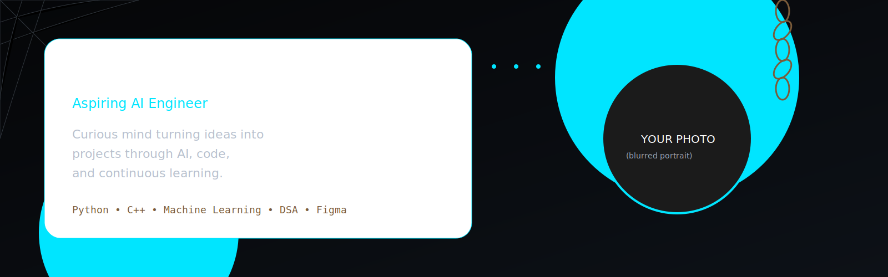

<!-- ========================================================= -->
<!--                SAMEEKSHA SINGH GITHUB README              -->
<!--                    PART 1 - HERO SECTION                  -->
<!-- ========================================================= -->

<div align="center">

<!-- Banner -->



<br><br>

<!-- Profile Picture -->


#  Sameeksha Singh

### **Aspiring AI Engineer • Machine Learning Enthusiast**


<br>


</div>

---

# ⚡ About Me

```yaml
Name        : Sameeksha Singh

Pronouns    : She / Her

Education   : B.Tech Electronics & Communication Engineering

College     : Indira Gandhi Delhi Technical University for Women

Graduation  : 2029

Location    : Delhi, India

Current     : Student

Dream Role  : AI Engineer

Currently   :
    - Machine Learning
    - Data Structures & Algorithms
    - UI/UX (Figma)
    - Building Real Projects

```

---

## 🖤 A little about me...

Hi! I'm **Sameeksha**, a B.Tech Electronics and Communication Engineering student at **IGDTUW** with a growing passion for **Artificial Intelligence**, **Machine Learning**, and **Data Structures & Algorithms**.

I love solving problems, participating in hackathons, and building projects that help me **learn by doing**.

I'm currently exploring **Machine Learning** through my funded internship while strengthening my DSA skills and learning UI/UX with Figma.

My long-term goal is simple:

> **Become an AI Engineer who builds products that genuinely help people.**

---

# ⚙ Current Focus

```text
Building

██████████░░░░░░░░░ Fraud Detection Project

████████████░░░░░░░ DSA

█████████░░░░░░░░░░ Machine Learning

███████░░░░░░░░░░░░ UI/UX

█████░░░░░░░░░░░░░░ System Design
```

---

# 🌙 Interests

<div align="center">

| ❤️ Love | 🌱 Learning | 🚀 Building |
|----------|------------|------------|
| Machine Learning | Figma | Fraud Detection |
| DSA | TensorFlow | Portfolio Website |
| Hackathons | OpenCV | Python Projects |
| Problem Solving | Deep Learning | AI Projects |

</div>

---

# 🎯 Developer Philosophy

> **Curious mind turning ideas into projects through AI, code, and continuous learning.**

> **Learning, building, and growing — one project at a time.**

---

# 🕸 Fun Timeline

```text
Turbo C++

        ↓

First Program

        ↓

Discovered Problem Solving

        ↓

Started DSA

        ↓

Hackathons

        ↓

Funded ML Internship

        ↓

Building Fraud Detection

        ↓

AI Engineer (Loading...)
```

---

<div align="center">

## ⚡ Current Status

🌱 Learning something every day

💻 Building consistently

🤝 Always open to collaboration

☕ Powered by coffee and curiosity

</div>

---

<!-- END OF PART 1 -->
