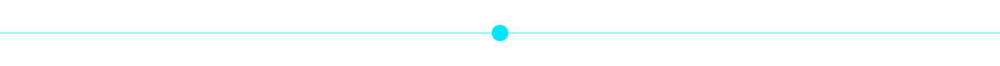
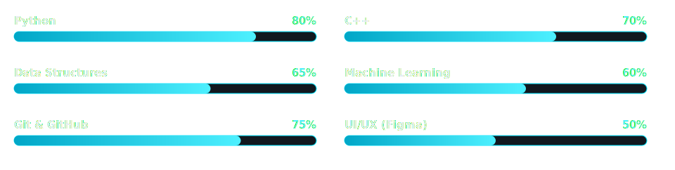
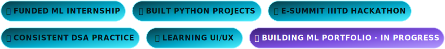

 

### 🕸️ &nbsp; Welcome &nbsp; 🕸️

**Aspiring AI Engineer • Machine Learning Enthusiast**

 

## 🖤 &nbsp; A little about me

Hi! I'm **Sameeksha**, a B.Tech Electronics and Communication Engineering student at **IGDTUW** with a growing passion for **Artificial Intelligence**, **Machine Learning**, and **Data Structures & Algorithms**.

I love solving problems, participating in hackathons, and building projects that help me **learn by doing**.

I'm currently exploring **Machine Learning** through my funded internship, strengthening my DSA skills, and learning UI/UX with Figma.

My long-term goal is simple:

> **Become an AI Engineer who builds products that genuinely help people.**

## 🌙 &nbsp; Interests

  

  

## 💻 &nbsp; Tech Stack

## 🧠 &nbsp; Machine Learning Toolbox

## ⚔️ &nbsp; Skills Progress

## 🏆 &nbsp; Achievements

<h2 align="center">🚀 &nbsp; Featured Projects</h2>

Projects that represent my learning journey and growth.

 

<table width="100%">

<tr>
<td width="50%" valign="top">

### 💳 Credit Card Fraud Detection
> 🚧 Currently Building

**Tech Stack:** Python · Scikit-learn · Pandas · NumPy · XGBoost · Random Forest

**Features:** Data Cleaning · Feature Engineering · Fraud Prediction · Model Evaluation · ROC Curve · Confusion Matrix · Explainable AI *(planned)*

**Goal:** Build a real-world fraud detection system capable of identifying suspicious transactions with high precision.

`Coming Soon ⭐`

</td>
<td width="50%" valign="top">

### 🌐 Portfolio Website
> 🚧 In Progress

**Tech Stack:** Next.js · Tailwind CSS · Glassmorphism · Responsive Design

**Sections:** Home · About · Projects · Skills · Resume · Contact

`Coming Soon ⭐`

</td>
</tr>

<tr>
<td width="50%" valign="top">

### 🧮 LeetCode Journey
Daily DSA practice across Arrays, Strings, Linked Lists, Trees, Graphs, and Dynamic Programming.

**Current Goal:** 🎯 300 Problems

</td>
<td width="50%" valign="top">

### 🐍 Python Mini Projects
A collection of projects built while learning: Password Generator, Calculator, File Organizer, Automation Scripts, and small ML experiments.

</td>
</tr>

</table>

## 📈 &nbsp; GitHub Analytics

<h3 align="center">🐍 Contribution Matrix</h3>

<picture>
  <source media="(prefers-color-scheme: dark)" srcset="https://raw.githubusercontent.com/sameekshasingh-exe/sameekshasingh-exe/output/github-contribution-grid-snake-dark.svg" />
  <source media="(prefers-color-scheme: light)" srcset="https://raw.githubusercontent.com/sameekshasingh-exe/sameekshasingh-exe/output/github-contribution-grid-snake.svg" />
  
</picture>

## 📊 &nbsp; GitHub Universe

  

## 🖤 &nbsp; Connect With Me

### 🌙 Thanks for stopping by

*"Learning isn't a race.*
*It's a collection of small wins repeated every day."*

 

